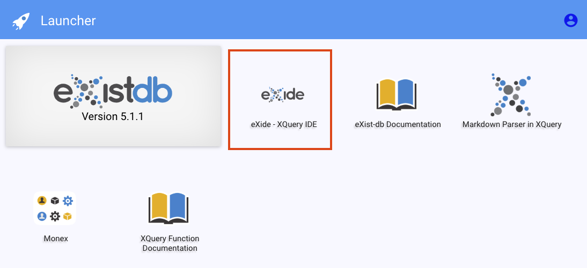
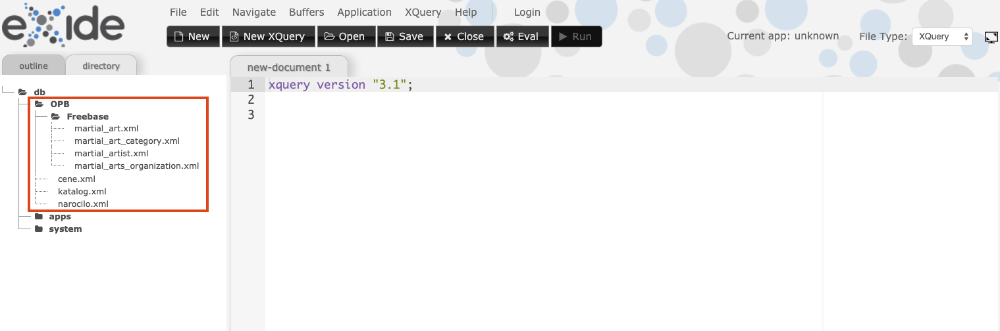

# Introduction to Databases - lab environment setup (eXist)

The repository is created for lab sessions during the Introduction to Databases course at the University of Ljubljana, Faculty for computer and information science.

## 

To start the server, use the following command:

```
docker run -it -d -p 8881:8080 --name opb-exist szitnik/opb-exist
```

When the server is running, navigate to [http://localhost:8881](http://localhost:8881) to access eXide server user interface (on Windows machines use docker machine's IP instead of localhost).

To access the query interface, select "eXide - XQuery IDE" option:



In the XQuery IDE check whether all the files are available to you, enter a query in the main window and run it with the button "Eval".




When you finish, run `docker rm --force opb-exist`.